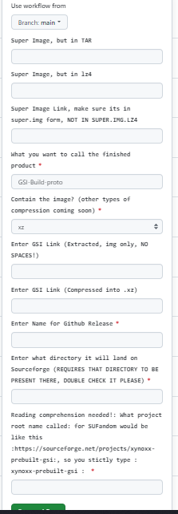
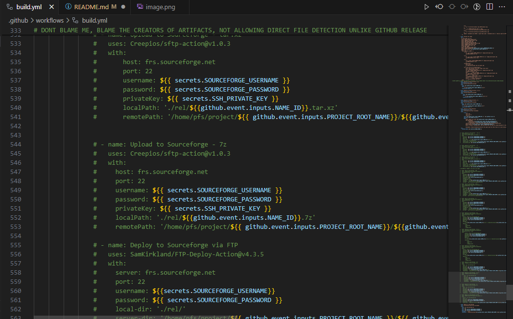
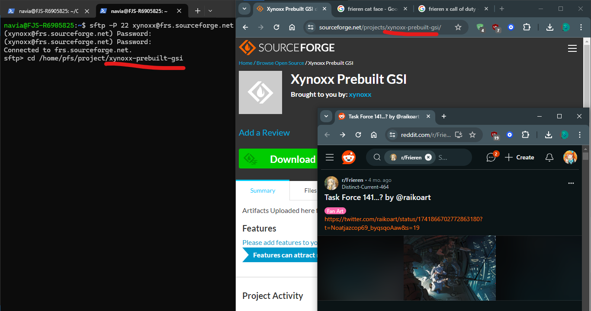

<h1> Super Patch In Action</h1>
A Samsung super.img Editor for you to install GSI (Geneeric System Image) on the web!

No Linux, or WSL, or Termux Needed!

----

<h3>Badges</h3>

   

 

 

 

*thats a **LOT** of Badges*

----

 
<h3>What is this?</h3>

This is a repository that can make your inserting your favourite ROM to your samsung device, best, with no more pesky hardware requirements, " *looking at you, super-patch with no proper WSL1 support* "

Right now, the options are very confusing at best:

 

istg this is hell-looking, im still new with the yaml stuff

and the source structure is uhhhhhhh:

I swear ill clean this up, in the coming updates of the script and make it easy to use at least

### Why is this

Yeah, what's the reason why this is the 'best' option of patching super.img?

Table:

| Conditions            	| SUPER-PATCH [LOCAL]                                                                                                                                                                                                                                                         	| **THE ALL NEW SUPER-PATCH-ACTIONS**                                                         	|
|-----------------------	|-----------------------------------------------------------------------------------------------------------------------------------------------------------------------------------------------------------------------------------------------------------------------------	|---------------------------------------------------------------------------------------------	|
| Hardware Requirements 	| **Linux**  - 4GB OF RAM WITH 128GB OR MORE **SSD** RECOMMENDED, **AMD64 ONLY**  **WINDOWS**  - 8GB OF RAM + WSL 2 (Core i3, 7th Gen or Later), **SSD ONLY**  **ANDROID**  - (64 BIT ONLY) 4GB OF RAM + ARM CORTEX A55 OR LATER, 128GB STORAGE 	| Just fast Internet, and a supported Web3 Browser, LMAO                                      	|
| STORAGE               	| 128GB AS MINIMUM, DESKTOP (SATA/NVMe SSD ONLY, FOR WINDOWS), (eMMC, SATA, NVME FOR LINUX)                                                                                                                                                                                   	| 15-20GB ONLY                                                                                	|
| TIME BUILD            	| 13 Mins at Max, even more if the internet is slow                                                                                                                                                                                                                           	| 7 Min to 15 Min at Max (Tested on tar only compression)                                                                      	|
| SHARE YOUR BUILD      	| REQUIRES UPLOADING, THEN SHARING LINK FOR ONLY THAT BUILD                                                                                                                                                                                                                   	| LISTS AVAILABLE IN JUST ONE LINK                                                            	|
| NETWORK               	| Data Plan consuming                                                                                                                                                                                                                                                         	| ONE TIME UPLOAD BASE ASSETS, THEN YOU CAN JUST REUSE SUPER.IMG FILES, SAVING MORE DATA PLAN 	|

### Special Thanks to

@rsuntk - Rissu/RissuProject - https://gitlab.com/Rissu-Projekt - For giving Sourceforge Ideas

@pressidium - For LFTP Action Script - https://github.com/pressidium/lftp-mirror-action

@github and @microsoft - For their azure service

aria2

@rokibhasansagar - Slimhub Action Script 

docker

@Takumi123x - who founded the idea of a script that can modify super.img - https://github.com/Takumi123x/rou

@Physwizz - An Australian, on Telegram, the head of Exynos 850 Testing and Development, who gave support for this project

@Kirithethird - A filipino who supported the core version of this, because they wanted a builder that is perfectly verbose of the process

@TDD788 - TheDarkDeath788, who also contributed to Exynos 850 Testing and Development, also has some support on the core project - https://github.com/TDD788

<h2>Table of Contents</h2>

1 . <a href=#preparation>Preparation</a>
 
2. <a href=#upload>Upload</a>
 
3. <a href=#build>Build</a>
 
4. <a href=#report>Report</a>

## Preparation 

1. Fork this repository, by Pressing Fork on the Page
 
2. Name it what you want
 
3. Done!
 
4. Create a Sourceforge Account (Strictly necessary), follow the steps they provide and if the form box says <code>(optional)</code> , you can just leave them blank, and also don't forget to verify yourself.
 
5. Create a Project, any name will do
 
6. After creating a project, and followed every instruction provided by sourceforge, log in to <code>sftp</code>.
 
6.1. Go to Terminal, enter <code>sftp (ur username)@frs.sourceforge.net</code> , then enter
 
6.2. After that, type <code>cd /home/pfs/project/(your created project in sourceforge)</code>, and you should be in that root project directory
 
6.2.1. Make sure that you entered in should be followed by the link site of your project, for example:
 

The red line must be the same as the target
 
6.3. Try entering <code>mkdir test</code>, enter then refresh the page, check files tab. You should see the test directory there, which means it's working
 
7. after that please head to your repository settings and go to secrets > action, then create credentials
 
7.1. Create a Repository Secret
 
7.2. Name it: <code>SOURCEFORGE_USERNAME</code>
 
7.3. Then enter your username 
 
7.4. After creating the username, create another secret, called <code>SOURCEFORGE_PASSWORD</code>
 
7.5. Enter your password there, don't worry, your credentials are safe and non-duplicate
7.6. Create another secret, name it: <code>SOURCEFORGE_REPO_TARGET</code>, see 6.2.1, copy and paste that red line
 
8. and you are Done

---

## Upload

1. Create an account that would host your super.img file, i would recommend uploading the files to Internet Archive or file.io for some people that are familiar with their service
 
2. Upload your super.img file, (For Internet Archive Uploaders, please name your page title when you upload, properly)
 
3. Go to the files directory
 

 

 
4. And confirmed that it's there!

---

## Build

Here is your CVS Recipt, People!

1. Copy the link of uploaded super file, can be tar, lz4, or img file, just put them in the respective boxes, and only one of them are allowed, REMEMBER THAT AND STOP SENDING ISSUE PAGE ABOUT IT
 
2. enter what archive name you want it to be called, Default: <code>GSI-build-proto</code>
3. Compression Type:
 
Note: setting to uncompressed, wont apply any name u entered, just <code>super.img</code>
 
Another note: Selecting all, can have issues pushing to artifact, or releases , check the sourceforge instead
 
 
Set compression Types
 
- Tar (No compression, but contained, available in sourceforge)
 
- xz (Level 9 compression Type, can be on artifact build, releases, or sourceforge)
 
- 7z (a bit larger than xz but can be available on artifact, releases, and sourceforge)
 
- raw (super.img only)
 
- all (name says so, but some only available on artifacts and releases, while fully available on sourceforge)
 
4.1. Set GSI Link in img format, just copy and paste the source link, similar method to internet archive 
 
4.2. Set GSI link, compressed to .xz, commonly found on Phhusson's partner releases, just copy download link and paste it here, if there's an issue, please download manually, upload it and copy and paste a proper link.
 
5.Enter what directory subfolder, if you created a folder there (Sourceforge), type the folder there and add slash at the end, like: <code>FOLDER/</code>
 
6. Build!
 
7. DONE!!!

## Report

Submit your bug report at issues, ill respond to them, and make a fix

